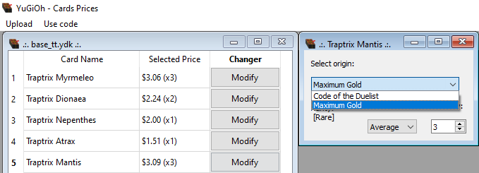

# YuGiOh Cards Prices
> English not my first language

Simple Python app that uses .ydk files to calculate those cards' prices.

## Table of contents
* [Introduction](#introduction)
* [Technologies](#technologies)
* [Ilustrations](#ilustrations)
* [To-Do](#to-do)

## Introduction
This project aims to provide an easy way to calculate the price of an entire deck by uploading a .ydk file instead of searching card by card all the time.

## Technologies
Project created with:
* Python v3.8
* PyQt5 v5.15.2
* PyQtWebEngine v5.15.2
* requests v2.24.0

## Ilustrations
Loading YDK                              | Selecting Prices 
:---------------------------------------:|:----------------------------------------------:
 | 

## To Do
* Rename windows to reflect .ydk file name
* Create keys to easily share the price online (When selling a deck based on the .ydk file)
* Size of name holder when selecting card price